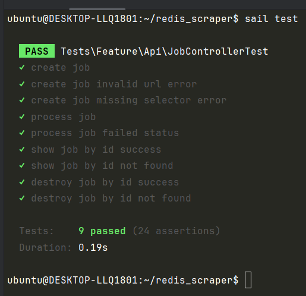

# Project Overview
[Project requirements](/task.png)

## How to Run the Project

1. Clone the repository.
2. Start the application using:

   ```bash
   sail up -d
   ```

## Running Tests

   ```bash
   sail test
   ```


## What was done:

### api.php
Added routes for the API

### JobController
This controller calls ScrapeJob, that knows about the business logic.

### ScrapeJob service
The ScrapeJob class encapsulates all the business logic related to job creation, processing, and data scraping.
It acts as the primary interface for external code (controllers, services...).

### Tests
Added only integration tests for the controller.




